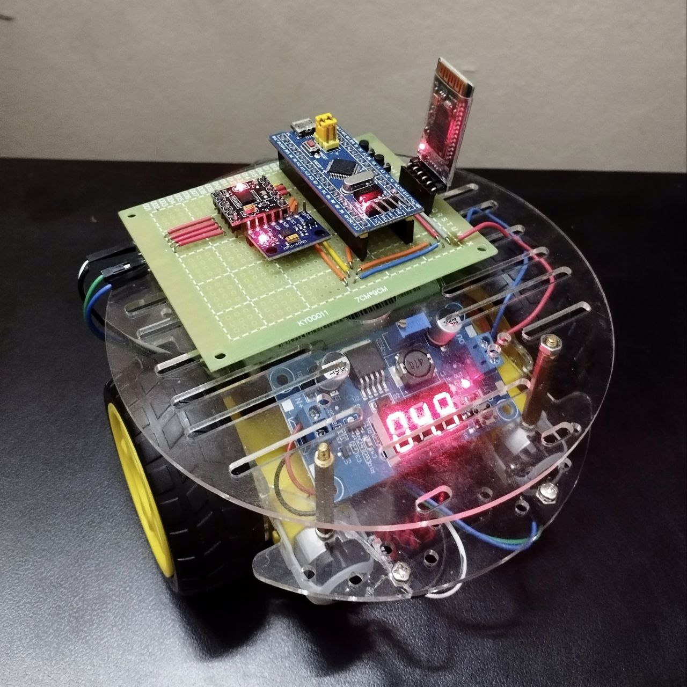
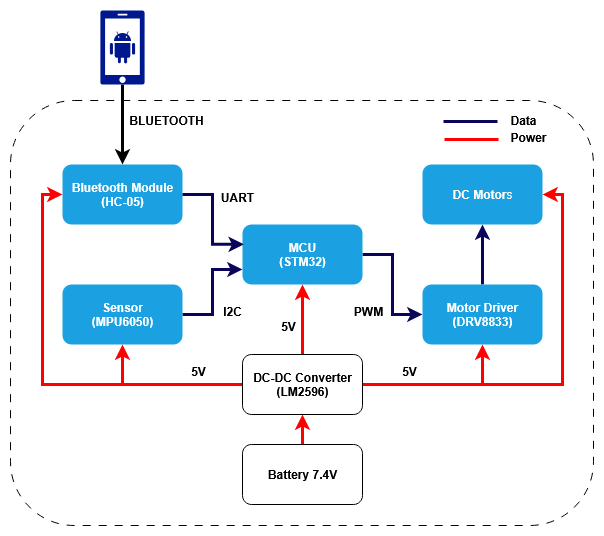
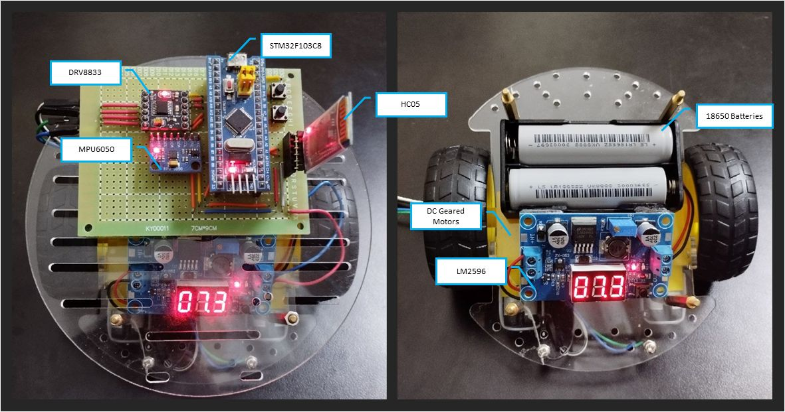
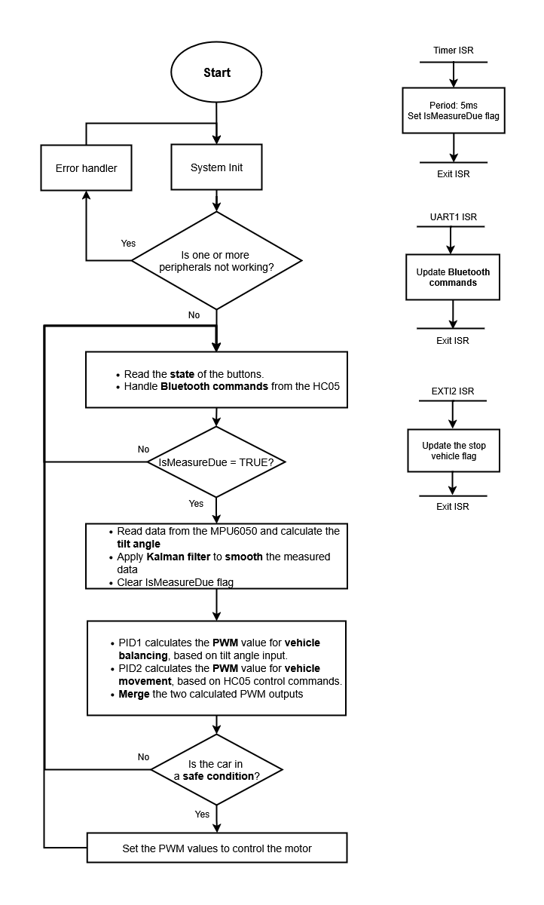

<!-- PROJECT LOGO -->
<br />
<div align="center">
  <a href="https://github.com/bitbydat/Self-Balancing-Car">
    
  </a>

<h3 align="center">Two-Wheeled Self-Balancing Robot</h3>

  <p align="center">
    A little DIY project. It falls more than it stands, but still looks pretty cool.
    <br />
    <br />
    <a href="https://github.com/bitbydat/Self-Balancing-Car/issues">Report Bug</a>
    ·
    <a href="https://github.com/bitbydat/Self-Balancing-Car/issues">Request Feature</a>
  </p>
</div>


<!-- TABLE OF CONTENTS -->
<details>
  <summary>Table of Contents</summary>
  <ol>
    <li>
      <a href="#about-the-project">About The Project</a>
      </ul>
    </li>
    <li>
      <a href="#getting-started">Getting Started</a>
      <ul>
        <li><a href="#prerequisites">Prerequisites</a></li>
        <li><a href="#installation">Installation</a></li>
      </ul>
    </li>
    <li><a href="#usage">Usage</a></li>
    <li><a href="#roadmap">Roadmap</a></li>
    <li><a href="#contributing">Contributing</a></li>
    <li><a href="#license">License</a></li>
    <li><a href="#contact">Contact</a></li>
    <li><a href="#acknowledgments">Acknowledgments</a></li>
  </ol>
</details>


<!-- ABOUT THE PROJECT -->
## About The Project

<p align="justify">
The objective of this project is to build a two-wheeled self-balancing car using a accelerometer sensor and a PID control algorithm to control the motors via PWM signals. Additionally, this car can receive commands from a mobile app via Bluetooth to move forward, backward, turn left, or turn right. 

<div align="center">
  <a href="https://github.com/bitbydat/Self-Balancing-Car">
    
  </a>
</div>
<p align="justify">
I chose the MPU6050 accelerometer and gyroscope sensor to calculate the tilt angle of the car, then applied a Kalman filter to smooth the data. The tilt angle, angular velocity, and control commands received from the HC-05 module are used as inputs to the PID controller. The output of the PID controller is used to generate PWM voltage signals to control the two DC motors. </p>

<!-- GETTING STARTED -->
## Getting Started
To get started with this project, you will need to prepare some items:
| Hardware | Reason for Selection |
|----------|----------|
|x01 STM32F103C8 microcontroller| A low-cost and high-performance 32-bit microcontroller, featuring I2C and UART interfaces |
|x01 MPU6050 accelerometer and gyroscope sensor| Combines a 3‑axis accelerometer and a 3‑axis gyroscope. Operates at 3.3–5V with an I2C interface (up to 400 kHz clock speed)|
|x01 DRV8833 motor driver| Dual H‑Bridge motor driver capable of driving two DC geared motors. Input voltages range of 3V-10V and provides output current up to 1.5A RMS|
|x02 DC gear motors (encoders optional but recommended)| Operating voltage 5V–7V. No‑load current ≤ 0.5A and speed ranges from 100–200 RPM @5V |
|x01 LM2596 DC-DC converter| Wide input voltage range: 4.5–30V and up to 3A output current|
|x02 18650 batteries| Two cells in series provide 7.4–8.1 V, suitable for LM2596 input to maintain a 5V output|
|x01 robot chassis with wheels| Optional design depending on project scope|

<div align="center">
  <a href="https://github.com/bitbydat/Self-Balancing-Car">
    
  </a>
</div>

  
Now that the hardware setup is complete, let's move on to the software developement. Below is the flowchart of the system, let's take a look.

<div align="center">
  <a href="https://github.com/bitbydat/Self-Balancing-Car">
    
  </a>
</div>  


My program uses three types of interrupts to update data and button control flags:
- The USART interrupt is used to receive Bluetooth commands sent from a mobile app.  
- The Timer interrupt sets the IsMeasureDue flag, allowing readings the MPU6050 sensor at precise 5ms intervals.  
- The EXTI interrupt is used to update the state of buttons that control the vehicle.</p>

In the super loop, the program continuously cycles through a set of functions:
- Update the control flags associated with button inputs
- Process Bluetooth commands, converting them into values, which are used as PID controller 2's inputs to calculate motor PWM values.
- Data is read from the MPU6050 using I2C. The tilt angle is calculated using both accelerometer and gyroscope data. A Kalman filter is appllied to minimize noise and improve data stability.
- Two PID controllers are used to update the PWM values for channels A and B on each wheel
- Finally, the program checks if the system is in a safe condition. It will set the calculated PWM values to the DRV8833 motor driver to control motors.

For a more details, please check the source code

### Installation

This project uses the ***arm‑none‑eabi‑gcc*** toolchain to compile through ***Makefile*** and supports debugging with ***OpenOCD & GDB*** or with ***J‑Link***, so you’ll need to install the required tools before getting started.
1. Clone the repo:
   ```sh
   git clone https://github.com/bitbydat/Self-Balancing-Car.git
2. Download the [GNU Arm Embedded Toolchain](https://developer.arm.com/downloads/-/gnu-rm), which includes  arm‑none‑eabi‑gcc,   arm‑none‑eabi‑gdb,  and the accompanying utilities.
3. Follow the instructions to install [MSYS2](https://www.msys2.org/), open MSYS2 terminal and run this commands to install GNU make
    ```sh
    pacman -Syu
    pacman -S make
Run this to check if Make is installed completely
   ```sh
     make --v
   ```

5. Download the latest version of [OpenOCD](https://github.com/xpack-dev-tools/openocd-xpack/releases) for debugging
6. Download the [ST-LINK utility](https://www.st.com/en/development-tools/stsw-link004.html) or [J-link Software](https://www.segger.com/downloads/jlink/) to flash firmware to the microcontroller.
   

<!-- USAGE EXAMPLES -->
## Usage

<!-- ROADMAP -->
## Roadmap and Future work

<!-- CONTRIBUTING -->
## Contributing

I welcome contributions to this project. If you have suggestions, improvements, or new ideas, feel free to open an issue or submit a pull request. Your input is greatly appreciated and helps me improve.

<!-- CONTACT -->
## Contact

Dat Duy Nguyen - datndng01@gmail.com

Project Link: [https://github.com/bitbydat/Self-Balancing-Car/](https://github.com/bitbydat/Self-Balancing-Car/)

</p>
